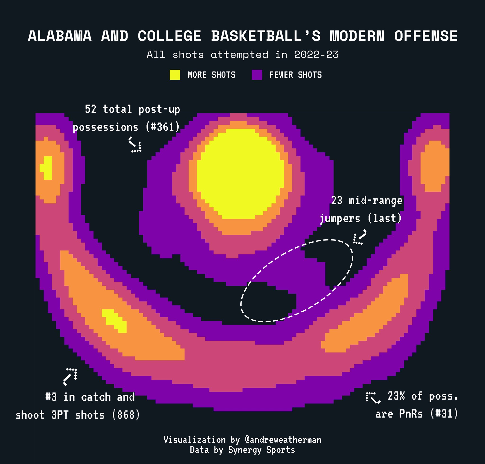
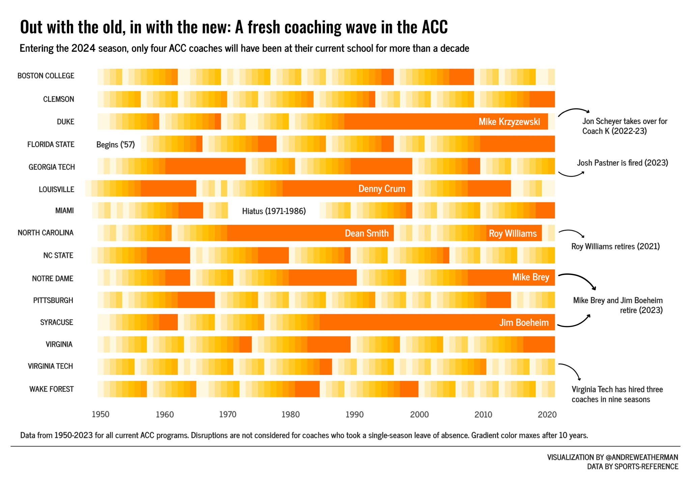
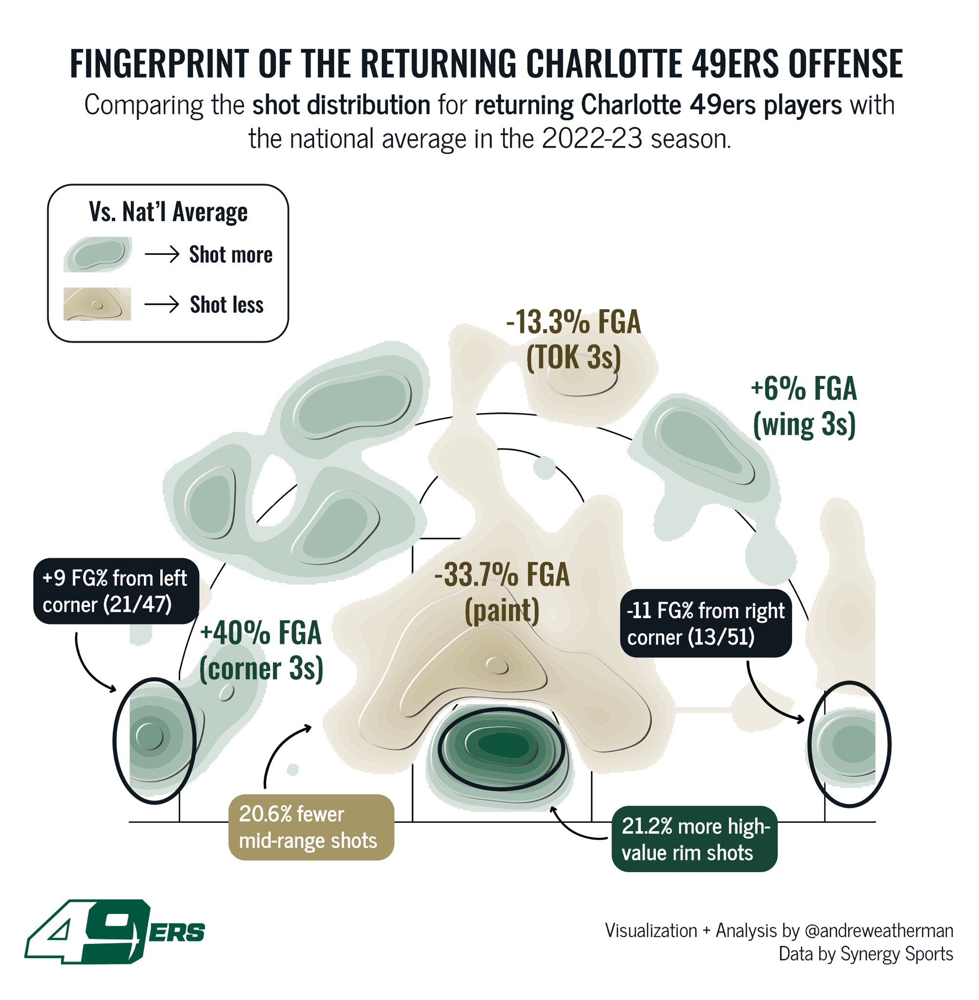
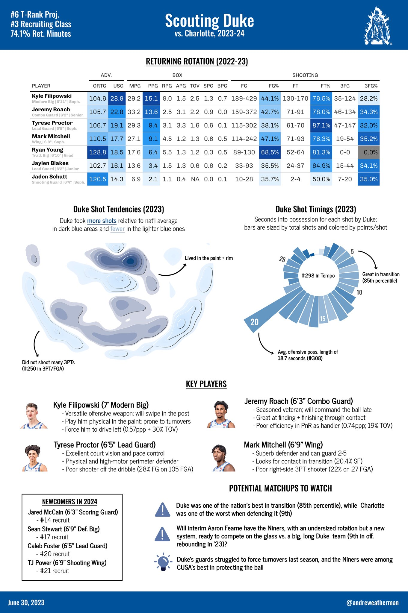
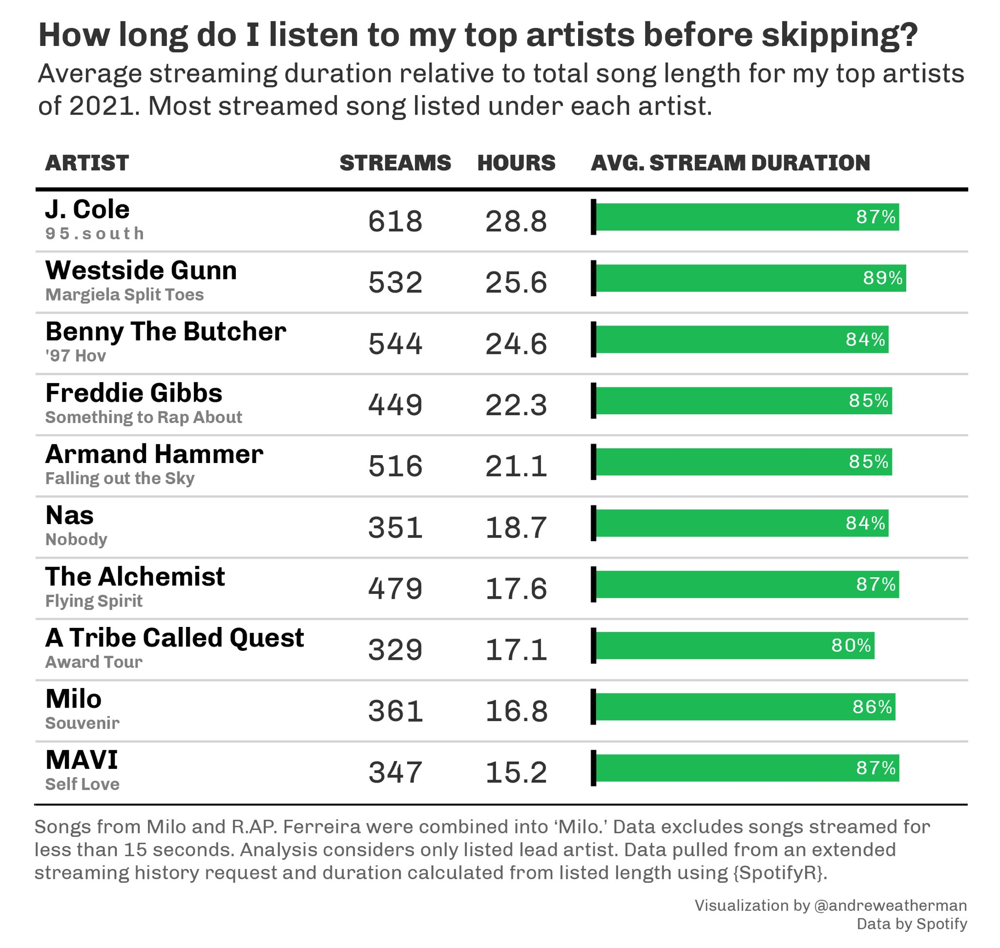
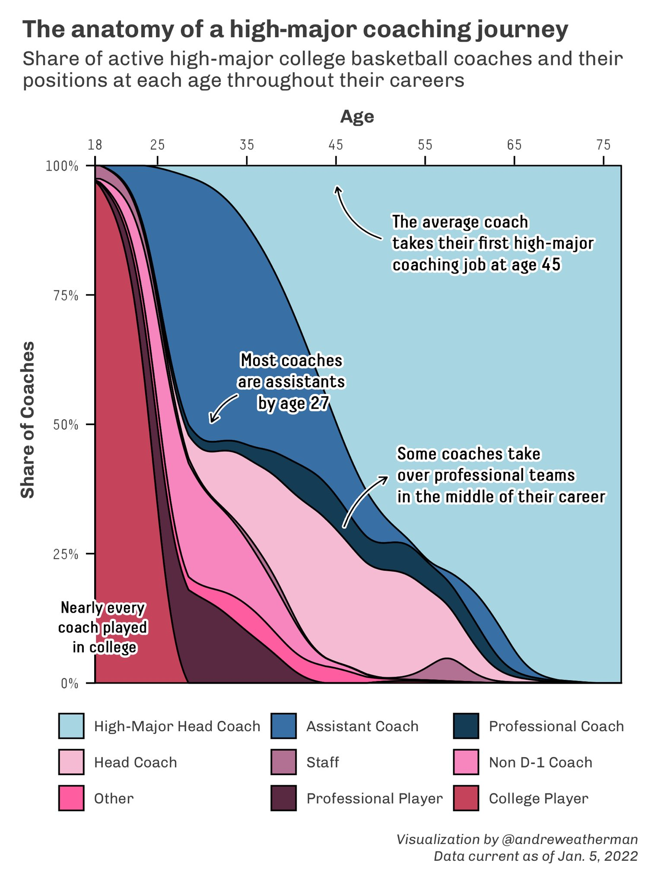
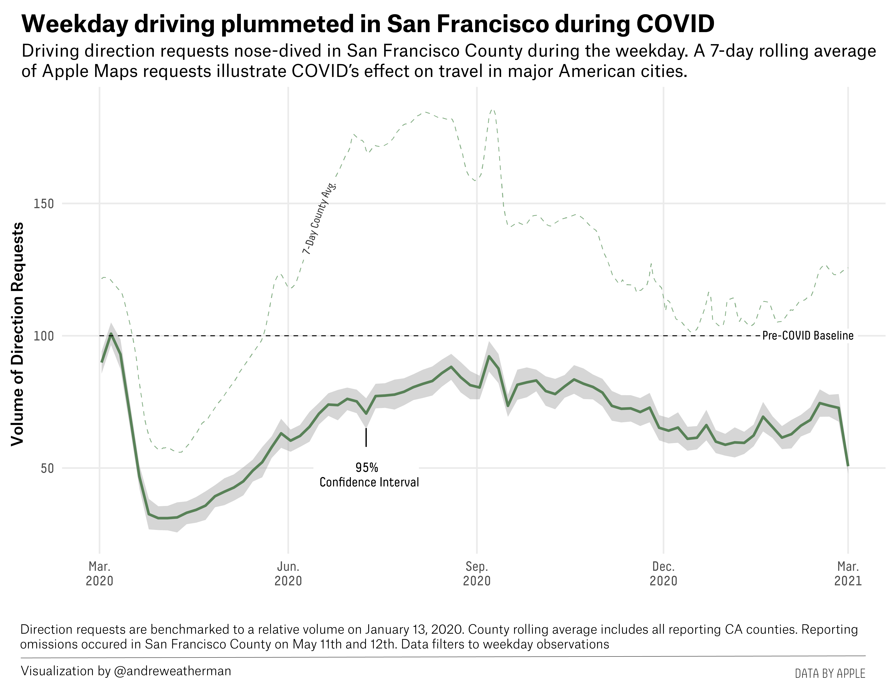

This repository features several visualization samples. All were made in `R` using the `ggplot2` package, the `gt` package, and/or several other packages. For some plots, I used Adobe Photoshop to add annotations or titles.

Some highlights:

## Nate Oats hates the midrange

## The shift of generational coaches out of the ACC

## The fingerprint of the Charlotte 49er offense

## A scouting report of the Duke Blue Devils

## My 2021 Spotify listening habits

## The anatomy of a high-major coaching journey

## Weekly driving trends during COVID in San Francisco
